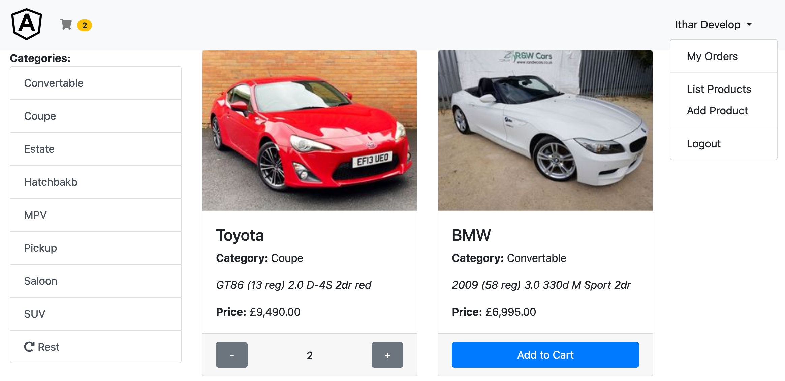

# angular-shopping-cart-app
Shopping cart hosted on firebase with login and order mangement.

#### Features 
- Single-page application 
- Firebase database 
- Login (via Google oauth2)
- User authentication & routing 
- Protected admin screens
- Two way form binding
- Multiple views component
- Local storage shopping cart
- Dynamic basket tracking
- Shared order item component

## 

## Application Stack

Stack  | version |
--- | --- |  
*Frontend* | Angular 10.0.12
*Node* | v12.18.1
*Hosting* | firebase (8.9.0)
*Build Tool* | Angular CLI
*CI* | n/a 
*Code Coverage* | n/a

## Prerequisite 
- node
- npm
- Angular CLI
- Firebase Project (oshop-angular-v1)

#### NPM Packages
```
npm i --save firebase
npm i --save @angular/fire
npm i --save bootstrap
npm i --save uuid
npm i --save font-awesome
sudo npm i -g firebase-tools
ng add @ng-bootstrap/ng-bootstrap
```

## Application Build/Components 
```
ng new oshop
cd oshop
ng g c navbar
ng g c home
ng g c login
ng g c shopping-cart
ng g c place-order
ng g c order-item
ng g c my-orders
ng g c admin/admin-products
ng g c admin/admin-product-form

ng g s service/auth
ng g s service/auth-guard
ng g s service/user
ng g s service/admin-auth-guard
ng g s service/category
ng g s service/product
ng g s service/cart
ng g s service/order
ng g s service/navigation
```

## Application Run
```
cd oshop 
ng serve
```

## Application Deploy
```
cd oshop
ng build --prod

firebase login
firebase depoly
```


## Application URL
LocaL : http://localhost:4200

Hosting: https://oshop-angular-v1.web.app

Console: https://console.firebase.google.com/project/oshop-angular-v1/overview

## Further enhancements 
- Mobile view responsive
- Registration page
- Data-tables listing page
- Fix (Fb/Twitter) social sign-in

-----

